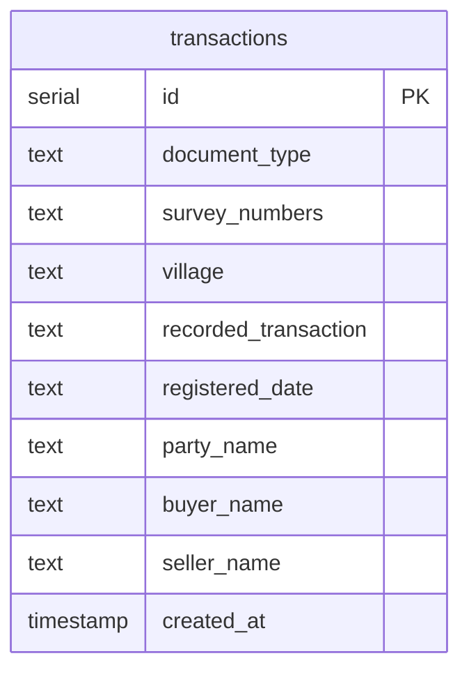

# Tamil EC PDF Parser

This is a full-stack tool for extracting data from Tamil Encumbrance Certificate (EC) PDFs, translating fields to English, and storing them in a searchable DB.

## Quick Start

### 1. Prerequisites
*   Node.js (v18+)
*   PostgreSQL running locally

### 2. Environment Variables
Add a `.env` in `backend/`:
```env
DATABASE_URL=postgres://localhost:5432/pdf_extraction
PORT=4000
```

Add a `.env.local` in `frontend/`:
```env
NEXT_PUBLIC_API_URL=http://localhost:4000
```

### 3. Setup
```bash
# Terminal 1 - Backend
cd backend
npm install
npx drizzle-kit push  # Sync the schema
npm run start:dev

# Terminal 2 - Frontend
cd frontend
npm install
npm run dev
```

App runs at: [http://localhost:3000](http://localhost:3000)
Login: `admin@test.com` / `123456`

---

## Technical Overview

### Architecture
*   **Frontend**: Next.js 15 (App Router) + Tailwind CSS.
*   **Backend**: NestJS (TypeScript).
*   **Database**: PostgreSQL + Drizzle ORM.
*   **Translation**: Google Translate API (`@vitalets/google-translate-api`).
*   **Parsing**: `pdf-parse` for buffer extraction + Regex patterns for field identification.

### Database Schema
I used Drizzle to manage the schema. Here's the layout of the `transactions` table:



### Known Constraints / Assumptions
1.  **Format**: The regex patterns are tuned for standard Tamil EC layouts. If the layout changes significantly, the parser might need adjustments.
2.  **Selectable Text**: This uses standard PDF text extraction. It doesn't include OCR, so it won't work on scanned images/photos.
3.  **Translation**: Names and specific regional terms are translated automatically. It's accurate for general use but might need verification for legal filings.
4.  **Auth**: Security includes a 15-minute inactivity timeout and a "Remember Me" toggle (local storage based).
