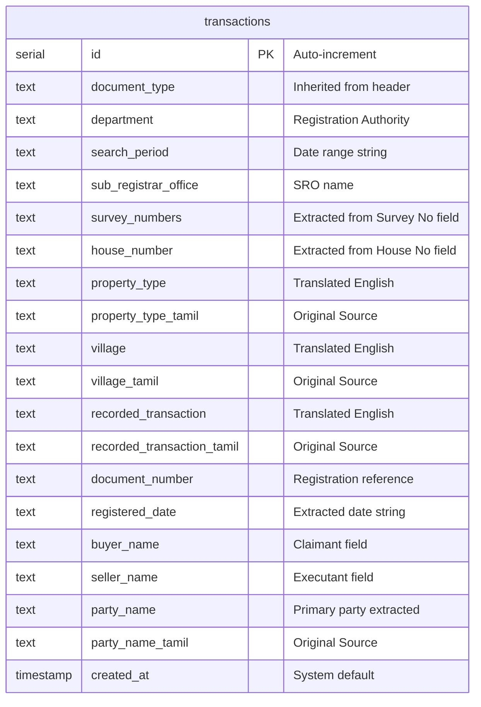

# Database Schema

The system uses a single table `transactions` to store the processed records. We store both the extracted Tamil text and its English translation to support localized search and original document verification.

## Tables

### `transactions`
Primary table for storing parsed EC data.

## Implementation Notes
*   **ORM**: Managed via Drizzle ORM (`pgTable`).
*   **Migrations**: Handled via `drizzle-kit push` for immediate schema syncing.
*   **Indexing**: Current search relies on ILIKE queries across `buyer_name`, `seller_name`, and `survey_numbers`. Full-text search indices can be added to the text columns if the dataset grows significantly.
